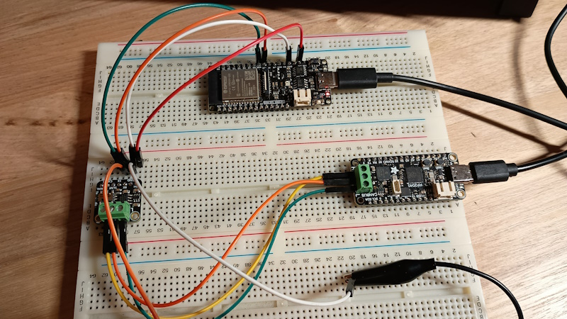
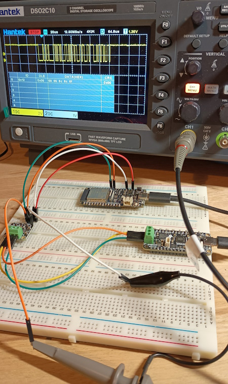

### rp2040_CAN and esp32 CAN

Using a CAN transceiver to enable CAN messages on the ESP32. Espressif call their CAN standard TWAI. The adafruit example code didn't work on the ESP so I used the TWAI reference code.

### Hardware Used ###
* Firebeetle 2 esp32e https://www.dfrobot.com/product-2195.html
* Adafruit CAN Transceiver TJA1051T https://www.adafruit.com/product/5708
* RP2040 with MCP2515 CAN https://www.adafruit.com/product/5724

### Setup ### 
* Connect as shown in the image
* Open the arduino IDE and load each sketch on the correct boards. You may need to install additional libraries
* Run the sketches and view the serial monitor or use ```minicom -b 115200 -D /dev/<your_port>```
* Some oscilloscopes can also decode CAN messages 






### References:
* https://github.com/adafruit/Adafruit_MCP2515/blob/main/examples/MCP2515_CAN_Receiver/MCP2515_CAN_Receiver.ino
* https://docs.espressif.com/projects/esp-idf/en/latest/esp32s3/api-reference/peripherals/twai.html